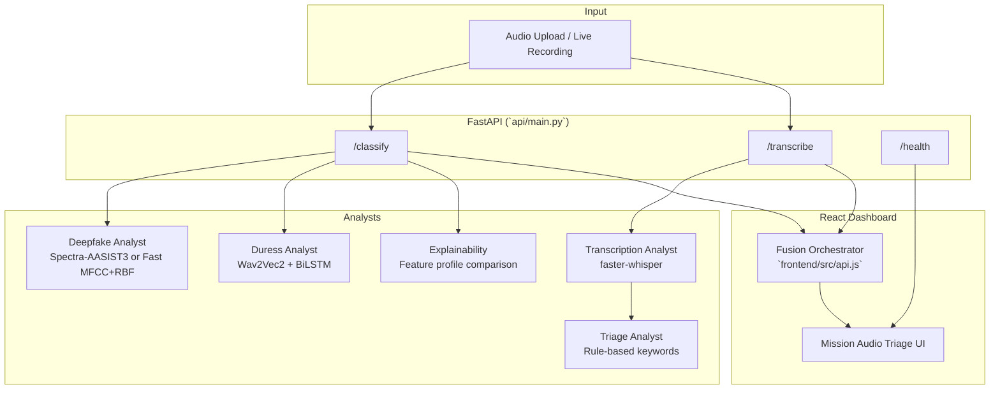

# SignalShield AI — Intelligent Pipeline Architecture

This document describes how the system's AI and analysis components are organized, configured, and orchestrated. **SignalShield does not use LLM-based agents** (no OpenAI, Anthropic, or prompt-driven tool loops). Instead, it composes specialized **analyst modules**—neural models, classical classifiers, and rule-based triage engines—that run in parallel and fuse their outputs into a single operational picture.

---

## System Overview



**Primary user flow:** the frontend calls `POST /classify` first (fast path for authenticity + duress), then `POST /transcribe` asynchronously (slower Whisper pass). The fusion layer in `api.js` merges deepfake scores, duress probability, transcript severity, and watchlist matches into risk bands and operator recommendations.

---

## Analyst Modules

### 1. Deepfake Analyst

| Property | Value |
|----------|-------|
| **Role** | Detect synthetic vs. authentic speech |
| **Entry points** | `src/inference.py`, `api/main.py` → `POST /classify` |
| **Backends** | `spectra` (neural) or `fast` (classical, default) |

#### Backend A: Spectra-AASIST3 (neural)

| Setting | Default | Notes |
|---------|---------|-------|
| Model | `lab260/Spectra-AASIST3` | HuggingFace; ~2.5 GB on first run |
| Encoder | Wav2Vec2 (bundled) | Frozen feature extractor |
| Device | `auto` (CUDA → MPS → CPU) | Via `src/model_loader.py` |
| Clip length | 64,600 samples @ 16 kHz | ~4.04 s |
| Decision mode | `argmax` | Env: `SPECTRA_DECISION=threshold\|argmax` |
| Threshold | `-1.460938` | Used only when `SPECTRA_DECISION=threshold` |
| Latency | ~190 ms p95 (MPS) | ASVspoof benchmark |

**Tools / dependencies:** PyTorch, torchaudio, transformers, HuggingFace Hub, vendor copy at `vendor/spectra_aasist3/`.

**Output schema:** `label` (`bonafide` \| `spoof`), `score_spoof`, `score_bonafide`, `confidence`, timing fields. `explanation` is always `null` for this backend.

#### Backend B: Fast MFCC + RBF SVM (classical)

| Setting | Default | Notes |
|---------|---------|-------|
| Model artifact | `results/fast_baseline_mfcc_rbf_svc_demo.joblib` | Falls back to ASVspoof-trained model |
| Features | 88-dim MFCC/LFCC + spectral stats | `src/fast_baseline.py` |
| Preprocess | 16 kHz mono, 4 s center crop/pad | Deterministic |
| Latency | ~7 ms p50 | Demo dataset: 99% accuracy |
| Explainability | Enabled when profiles exist | See module 5 |

**Tools / dependencies:** librosa, scikit-learn, joblib, numpy.

**Environment variables:**

```bash
MODEL_BACKEND=fast          # fast | spectra
FAST_MODEL_PATH=...         # Override .joblib path
SPECTRA_DECISION=argmax     # spectra backend only
```

---

### 2. Duress Analyst

| Property | Value |
|----------|-------|
| **Role** | Estimate acoustic stress / duress from voice timbre |
| **Entry point** | `src/duress_inference.py`, invoked from `POST /classify` |
| **Architecture** | `facebook/wav2vec2-base` → 2-layer BiLSTM (hidden=128) → sigmoid logit |
| **Weights** | `temporal_bilstm_duress.pth` (project root) |
| **Threshold** | `0.5` (env: `DURESS_THRESHOLD`) |
| **Toggle** | `DURESS_ENABLED=1` (set `0` to disable) |

**Tools / dependencies:** PyTorch, transformers (Wav2Vec2).

**Output schema** (nested under `duress` in `/classify` response):

```json
{
  "available": true,
  "label": "duress",
  "is_duress": true,
  "probability": 0.72,
  "probability_percent": 72.0,
  "threshold": 0.5,
  "inference_ms": 45.2
}
```

If weights are missing, `available: false` and the UI shows a graceful fallback.

---

### 3. Transcription Analyst

| Property | Value |
|----------|-------|
| **Role** | Speech-to-text for operational content review |
| **Entry point** | `transcriber.py` → `FastMilitaryTranscriber`, `POST /transcribe` |
| **Engine** | [faster-whisper](https://github.com/SYSTRAN/faster-whisper) (CTranslate2) |
| **Default model** | `tiny.en` | Env: `TRANSCRIBER_MODEL_SIZE` |
| **Device** | `cpu` | Env: `TRANSCRIBER_DEVICE` |
| **Compute type** | `int8` | Env: `TRANSCRIBER_COMPUTE_TYPE` |
| **VAD filter** | off | Env: `TRANSCRIBER_VAD_FILTER=1` for long/noisy clips |
| **Beam size** | 1 | Speed-optimized |

**Tools / dependencies:** faster-whisper, ffmpeg (system).

**Warm-up:** loaded lazily on first `/transcribe` request; background thread pre-warms at startup (`api/main.py` → `_warm_models`).

**Streaming mode** (CLI only): `python transcriber.py audio.wav --stream` emits JSON lines per segment for live dashboards.

---

### 4. Triage Analyst (Rule-Based)

| Property | Value |
|----------|-------|
| **Role** | Classify message category and severity from transcript text |
| **Entry point** | `transcriber.py` → `classify_message`, `score_severity` |
| **Method** | Keyword matching + weighted scoring (no ML, no LLM) |
| **Latency** | Sub-millisecond per segment |

#### Categories

`administrative`, `command`, `intelligence`, `logistics`, `medical`, `emergency`, `authentication`, `unknown`

#### Severity levels

| Level | Examples |
|-------|----------|
| `critical` | mayday, troops in contact, medevac, IED, overrun |
| `high` | hostile contact, engage, fire mission, compromised, drone/UAV |
| `medium` | movement, resupply, execute, secure, checkpoint |
| `low` | routine status, training, schedule, roll call |

#### External signal fusion

The triage analyst accepts **`external_signals`** to elevate severity when acoustic models flag risk:

```python
external_signals = {
    "deepfake_probability": 0.85,   # from Deepfake Analyst
    "duress_probability": 0.72,       # from Duress Analyst
    "lie_probability": 0.0,         # reserved for future use
}
```

Scoring rules (`transcriber.py` → `score_severity`):

- `≥ 0.85` on deepfake/duress/lie → +20 severity points
- `≥ 0.65` → +10 points
- Duress `≥ 0.5` → adds matched term `"acoustic duress signal"`

#### Custom watchlist

Operators can pass comma/semicolon/newline-separated terms via `custom_keywords` (API form field or CLI `--custom-keywords`). Each match adds `custom_keyword_weight` (default 20) severity points.

#### Benign-context guards

False-positive patterns are suppressed via `BENIGN_TERM_PATTERNS` and `BENIGN_HELP_CONTEXT` (e.g., "please help me carry groceries" vs. distress "please help").

**Audit tool:** `python phrase_audit.py` runs canned phrases through the classifier for regression checks.

---

### 5. Explainability Module (Fast Baseline Only)

| Property | Value |
|----------|-------|
| **Role** | Generate human-readable rationale for fast MFCC predictions |
| **Entry point** | `src/fast_explain.py` → `explain_fast_features` |
| **Method** | Class-profile comparison (z-score distance to bonafide vs. spoof training means) |
| **Profiles** | `results/fast_demo_feature_profiles.json` |
| **Rebuild** | `python scripts/build_feature_profiles.py` |

**Output:** `summary` (2 sentences), `top_signals` (top 3 features), `disclaimer` ("similarity to training distributions, not proof of synthesis method").

Not available for Spectra/Wav2Vec2 backends.

---

### 6. Fusion Orchestrator (Frontend)

| Property | Value |
|----------|-------|
| **Role** | Merge analyst outputs into risk bands and operator guidance |
| **Location** | `frontend/src/api.js` |
| **Functions** | `mapClassifyResponse`, `applyTranscriptionResult`, `applyDuressToRisk` |

#### Risk band logic

| Condition | Risk | Recommendation |
|-----------|------|----------------|
| Spoof + high confidence | `CRITICAL` | ESCALATE — do not execute commands |
| Spoof/bonafide + low confidence (< 0.85) | `HIGH` | VERIFY — secondary channel |
| Bonafide + high confidence | `LOW` | TRUST — routine monitoring |
| Transcript severity `critical` | elevates to `CRITICAL` | ESCALATE |
| Transcript severity `medium`/`high` | elevates to `HIGH` | VERIFY |
| Duress ≥ 0.85 | elevates to `CRITICAL` | ESCALATE |
| Duress ≥ 0.65 or `is_duress` | elevates to `HIGH` | VERIFY |

This layer is **deterministic policy code**, not an LLM. Thresholds are tunable in `api.js`.

---

## API Orchestration (`api/main.py`)

### Startup lifecycle

1. Load deepfake backend (`initialize_inference_context`)
2. Load feature profiles if fast backend + profiles exist
3. Background thread warms: fast model dummy pass, Whisper model, duress model

### Endpoints

| Endpoint | Analysts invoked | Notes |
|----------|------------------|-------|
| `GET /health` | — | Reports backend, device, transcriber/duress status |
| `POST /classify` | Deepfake + Duress + Explainability | Single upload, synchronous |
| `POST /transcribe` | Transcription + Triage | Accepts `deepfake_probability`, `duress_probability`, `custom_keywords` |

### Environment reference

| Variable | Default | Module |
|----------|---------|--------|
| `MODEL_BACKEND` | `fast` | Deepfake Analyst |
| `FAST_MODEL_PATH` | demo or ASVspoof `.joblib` | Deepfake Analyst |
| `FAST_PROFILE_PATH` | `results/fast_demo_feature_profiles.json` | Explainability |
| `SPECTRA_DECISION` | `argmax` | Deepfake Analyst (spectra) |
| `DURESS_ENABLED` | `1` | Duress Analyst |
| `DURESS_MODEL_PATH` | `temporal_bilstm_duress.pth` | Duress Analyst |
| `DURESS_THRESHOLD` | `0.5` | Duress Analyst |
| `TRANSCRIBER_MODEL_SIZE` | `tiny.en` | Transcription Analyst |
| `TRANSCRIBER_DEVICE` | `cpu` | Transcription Analyst |
| `TRANSCRIBER_COMPUTE_TYPE` | `int8` | Transcription Analyst |
| `TRANSCRIBER_VAD_FILTER` | `0` | Transcription Analyst |
| `CORS_ORIGINS` | `localhost:5173` | API CORS |

---

## Interaction with Core Codebase

```
Hackathon/
├── api/main.py              # HTTP orchestration, model warm-up
├── transcriber.py           # Whisper + triage rules
├── src/
│   ├── inference.py         # Unified deepfake predict path
│   ├── fast_baseline.py     # MFCC feature extraction + sklearn
│   ├── fast_explain.py      # XAI for fast model
│   ├── duress_inference.py  # Acoustic duress model
│   ├── model_loader.py      # Spectra load + warmup
│   ├── audio_preprocess.py  # Decode, resample, crop/pad
│   └── config.py            # Paths, thresholds, constants
├── frontend/src/
│   ├── api.js               # Fusion orchestrator
│   └── App.jsx              # Mission Audio Triage UI
├── scripts/                 # Training, eval, dataset tools
└── results/                 # Model artifacts, metrics, profiles
```

### Signal flow (upload)

```
1. User uploads audio → App.jsx → classifyAudio()
2. POST /classify
   ├── decode_audio_bytes()
   ├── predict_one_from_bytes()  → deepfake label + scores
   ├── predict_duress_from_bytes() → duress probability
   └── explain_fast_features()   → rationale (fast only)
3. mapClassifyResponse() → initial risk band
4. transcribeAudio() → POST /transcribe (async)
   ├── FastMilitaryTranscriber.transcribe()
   ├── classify_message() per segment + full transcript
   └── external_signals fuse deepfake + duress into severity
5. applyTranscriptionResult() → final risk + recommendation
```

---

## Training & Evaluation Scripts

These scripts operate **outside** the live analyst pipeline but produce the artifacts analysts consume:

| Script | Purpose | Output |
|--------|---------|--------|
| `scripts/eval_asvspoof.py` | Spectra EER on ASVspoof 2019 LA | `results/scores_*.tsv` |
| `scripts/eval_fast_baseline.py` | Train/eval fast MFCC classifiers | `.joblib` + metrics |
| `scripts/train_demo_rbf.py` | Demo-tuned RBF SVM | `fast_baseline_mfcc_rbf_svc_demo.joblib` |
| `scripts/build_feature_profiles.py` | XAI class profiles | `fast_demo_feature_profiles.json` |
| `scripts/train_pooled_rbf.py` | Demo + ASVspoof pooled model | OOD generalization |
| `scripts/download_ood_testsets.py` | Held-out eval clips | `data/ood/` |

---

## Extensibility

### Adding a new analyst module

1. Implement inference in `src/` with a `@dataclass` result type
2. Wire into `api/main.py` lifespan + relevant endpoint
3. Extend `GET /health` status fields
4. Update `frontend/src/api.js` fusion logic
5. Document env vars in this file and `docs/API.md`

### Reserved hooks

- `external_signals["lie_probability"]` — triage scoring already supports it; no model wired yet
- `POST /classify` could be extended to run transcription inline (currently separate for latency)
- Streaming transcription events (`transcriber.py --stream`) could be exposed via WebSocket

---

## What This System Is Not

- **Not an LLM agent framework** — no prompts, tool calling, or chat completions
- **Not a multi-agent orchestrator** — modules are function calls, not autonomous agents
- **Not real-time streaming inference** — upload/record → batch analyze (except CLI `--stream`)

For API details see [docs/API.md](docs/API.md). For system layout see [docs/ARCHITECTURE.md](docs/ARCHITECTURE.md). For triage rules see [docs/TRIAGE.md](docs/TRIAGE.md).
