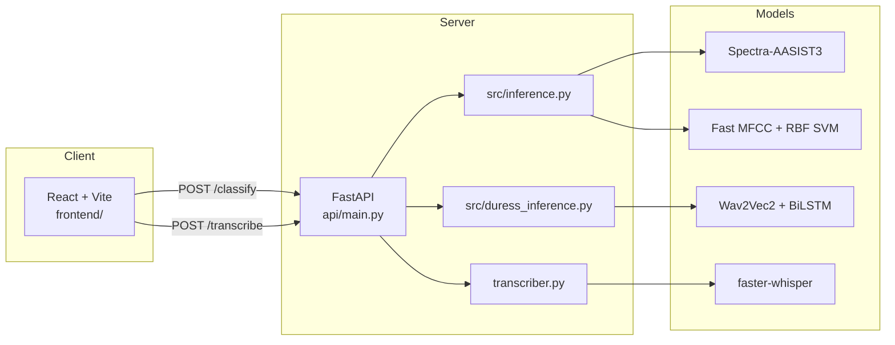

# Architecture

SignalShield AI is a hackathon-grade **mission audio triage platform**. It ingests audio clips, runs parallel ML and rule-based analyses, and presents fused risk assessments through a React dashboard.

---

## High-Level Components

---

## Directory Layout

| Path | Purpose |
|------|---------|
| `api/main.py` | HTTP service, CORS, model lifecycle, endpoints |
| `src/` | Core ML: inference, preprocessing, fast baseline, duress, explainability |
| `transcriber.py` | Whisper transcription + military message triage |
| `vendor/spectra_aasist3/` | Vendored Spectra-AASIST3 model wrapper |
| `frontend/` | Mission Audio Triage dashboard (React) |
| `scripts/` | Dataset download, training, batch evaluation |
| `results/` | Trained `.joblib` models, metrics JSON, feature profiles |
| `data/demo/` | Gary Stafford deepfake demo dataset (~1.9k FLAC) |
| `data/ood/` | Out-of-domain held-out test clips |

---

## Audio Preprocessing Pipeline

All backends share common decode/resample logic in `src/audio_preprocess.py`:

1. **Decode** — raw bytes → waveform via soundfile/ffmpeg
2. **Mono** — average channels if stereo
3. **Resample** — target 16 kHz (`SAMPLE_RATE`)
4. **Crop/pad** — backend-specific clip length:
   - Spectra: 64,600 samples (~4.04 s), center crop
   - Fast: 64,000 samples (4 s), center crop

---

## Inference Backends

### Spectra-AASIST3 (neural)

- HuggingFace model `lab260/Spectra-AASIST3`
- Wav2Vec2 encoder + AASIST3 anti-spoof head
- GPU/MPS preferred; ~190 ms per clip on Apple Silicon
- **0.723% EER** on ASVspoof 2019 LA (published benchmark)
- Decision: `argmax` (logit comparison) or `threshold` (ASVspoof-tuned cutoff)

### Fast baseline (classical)

- 88 features: MFCC/LFCC means/stds, deltas, spectral centroid/rolloff, ZCR, RMS
- sklearn pipeline: `StandardScaler` → classifier (default: RBF SVM)
- CPU-only; ~7 ms per clip
- Demo-tuned model: **99% accuracy** on Gary Stafford TTS dataset
- Includes explainability via class-profile comparison

See [Agents.md](../Agents.md) for configuration and analyst-module details.

---

## Duress Detection

Separate from deepfake detection:

- **Model:** Wav2Vec2-base embeddings → 2-layer BiLSTM → sigmoid
- **Weights:** `temporal_bilstm_duress.pth` (must be present in project root)
- Runs on every `/classify` request when `DURESS_ENABLED=1`
- Output fused into frontend risk scoring

---

## Transcription & Triage

- **Engine:** faster-whisper (`tiny.en` default)
- **Triage:** rule-based keyword classifier in `transcriber.py`
- Categories: administrative, command, intelligence, logistics, medical, emergency, authentication
- Severity: low → medium → high → critical (weighted keyword scoring)
- Accepts external signals from deepfake/duress models to boost severity

See [docs/TRIAGE.md](TRIAGE.md) for full category/severity reference.

---

## Frontend Architecture

- **Stack:** React 18, Vite 5, Framer Motion, Lucide icons
- **Proxy:** Vite dev server proxies `/api/*` → `http://127.0.0.1:8000`
- **Flow:**
  1. Upload or record audio
  2. `POST /classify` → immediate authenticity + duress + rationale
  3. `POST /transcribe` (async) → transcript + category/severity
  4. Fusion in `api.js` → risk band + recommendation

---

## Data & Artifacts

| Artifact | Location | Used by |
|----------|----------|---------|
| Spectra weights | HuggingFace cache (auto-download) | Spectra backend |
| Fast demo RBF | `results/fast_baseline_mfcc_rbf_svc_demo.joblib` | Default fast backend |
| Fast ASVspoof RBF | `results/fast_baseline_mfcc_rbf_svc.joblib` | ASVspoof eval |
| Feature profiles | `results/fast_demo_feature_profiles.json` | Explainability |
| Duress weights | `temporal_bilstm_duress.pth` | Duress analyst |
| Demo dataset | `data/demo/deepfake-audio-detection/` | Training/eval |
| OOD clips | `data/ood/` | Generalization testing |

---

## Deployment Notes

- **Backend:** `uvicorn api.main:app --host 0.0.0.0 --port 8000`
- **Frontend dev:** `cd frontend && npm run dev` (port 5173)
- **Frontend prod:** `npm run build` → serve `frontend/dist/` via static host; set `VITE_API_BASE`
- **Dependencies:** Python 3.10+, Node 18+, ffmpeg, ~2.5 GB model download on first Spectra run
- **Secrets:** No API keys required; `.env` is optional (project uses env vars at runtime)

---

## Performance Benchmarks

| Model | Dataset | Metric | Latency |
|-------|---------|--------|---------|
| Spectra-AASIST3 | ASVspoof 2019 LA test | 0.723% EER | ~190 ms (MPS) |
| Fast RBF (ASVspoof) | ASVspoof validation | ~10% EER | ~6 ms |
| Fast RBF (demo-trained) | Gary Stafford demo | 99.0% acc | ~7 ms |
| Spectra + argmax | Gary Stafford demo | 92.6% acc | ~185 ms |

Full comparison files: `results/comparison_fast_vs_spectra.json`, `results/summary_demo_eval.json`.
